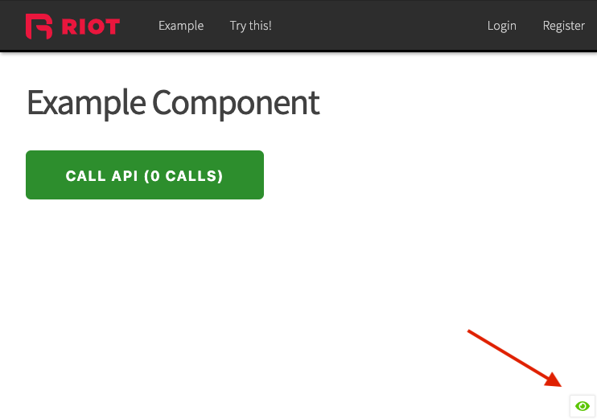
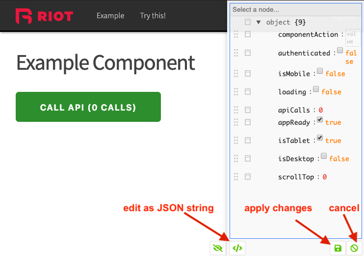
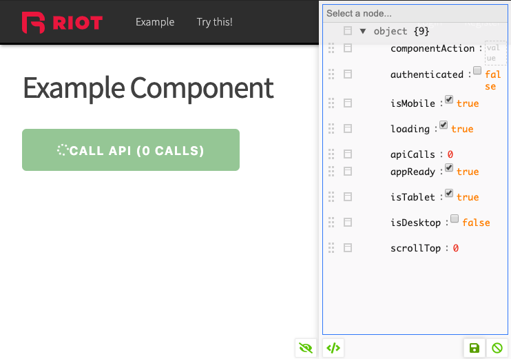

# Riot Meiosis

Meiosis state manager for Riot using Erre. [Learn more about meiosis](http://RiotMeiosis.js.org).

* [Usage](#usage)
* [API](#api)
    * [createStream(reducer, initialState)](#createstreamreducer-initialstate)
    * [connect(mapToState, mapToComponent)(MyComponent)](#connectmaptostate-maptocomponentmycomponent)
    * [getState()](#getstate)
    * [getStream()](#getstream)
    * [utils](#utils)
* [RM Dev Tools](#rm-dev-tools)

Key things to note:
- Implements a stream to update state
- Comes with a `connect` function to wrap stream functionality
- Components attempt to update when stream is pushed to
- Prevent component updates if state has not changed
- Stream listeners are destroyed when `onBeforeUnmount`

## Usage

```
npm i --save riot-meiosis
```

```js
import {
    connect,
    getState,
    createStream,
    getStream,
} from 'riot-meiosis';

// Set your initial state.
// State is only mutable via manager API.
const state = {
    initial: true,
    isNew: true,
    mutable: false,
    nested: {
        hasCandy: true
    }
};

// Root state reducer
const reducer = (newState, oldState) => ({
    ...oldState,
    ...newState
});

// Create global application stream (can only run once)
const stream = createStream(reducer, stub.state);

// stream is simply an Erre stream
stream.push({
    initial: false,
    isNew: false
});

console.log(getState());
// > {
//     initial: false,
//     isNew: false,
//     mutable: false,
//     nested: {
//         hasCandy: true
//     }
// }

```

In your `.riot` files:
```html

<myComponent>

    <p if={ hasCandy }>I have candy!</p>

    <script>

        import { connect } from 'riot-meiosis';
        import myActions from './actions';

        const mapToState = (appState, ownState, ownProps) => ({
            ...ownState,
            ...appState.nested
        });

        // Optional mapping of functions or objects to component
        const mapToComponent = myActions;
        // OR
        const mapToComponent = (ownProps, ownState) => myActions;

        const component = {

            onBeforeMount() {

                // connect will respect original onBeforeMount
                this.state = {
                    lala: true
                }
            }
        }

        export default connect(mapToState)(component);
        // OR
        export default connect(mapToState, mapToComponent)(component);
    </script>
</myComponent>
```

## API

```js
const {
    createStream,
    connect,
    getState,
    getStream,
    utils
} = 'riot-meiosis';
```


### `createStream(reducer, initialState)`

Simply put, this function returns an [Erre stream](https://github.com/GianlucaGuarini/erre#api) and sets your global application state. Both `stream` and `state` are only ever defined once, so you cannot run this function twice.

Both `reducer()` and `initialState` are required. You can set `initialState` to anything except `null` or `undefined`.

* `reducer` *function, required* - Reducer that transforms incoming payloads into global state
* `initialState` *any, required* - Initial app state. Can be set to anything except `null` or `undefined`.


### `connect(mapToState, mapToComponent)(MyComponent)`

Decorator for implement state management on a Riot component. Application state is mapped to Component state, stream updates generate component updates only when there are changes to the relevant state, and component cleans up and  stops listening to state changes `onBeforeUnmount`.

* `mapToState(appState, ownState, ownProps)` *function, required* - Function to reduce application state to relevant app state
* `mapToComponent`: Optional
    - *object* - Map an object to component
    - *function* - `(ownProps, ownState) => ({})` - Map a function's return value to component. Receives component props and state. Should return an object.

**Returns**

Function to pass your component into. The result value is used to `export default` inside your Riot component and have a component that is conditionally connected to global state.


### `getState()`

Returns the application state.


### `getStream()`

Returns the application state stream.


### utils

Utilities used by the library.

* `utils.arrayMatches(arr1, arr2)` - Checks to see if 2 arrays match
* `stateHasChanged(newState, oldState)` - Checks to see if state has changed by recursively matching primitives


## RM Dev Tools

Riot Meiosis comes with a dev tool to be able to look into your state and manipulate it directly. Here's how it works:

In your `app.js`
```js
import { register, component } from 'riot';
import { getStream, connect, RMDevTools } from 'riot-meiosis';

// You must pass it connect and getStream in order
// for it to return a mountable riot component
register('rmdevtools', RMDevTools({ getStream, connect }))
```

In your `app.riot` or `index.html`
```html
<html>
    ...
    <footer></footer>

    <rmdevtools></rmdevtools>
</html>

```

Examples of what it should look like:

### Closed

Devtools creates a floating icon on the page to toggle state



### Opened

By default, you can only view the state unless you choose to edit it


### Editing

By default, the editor will display as tree view.



### Text View

You can also swap out your entire state tree by pasting in a JSON string.


### After state was manipulated

After applying changes, a push will be sent to your stream and all connected components affected by the changes will be updated.



